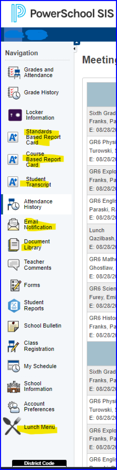
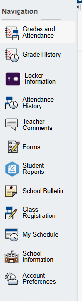

# Parent Portal Customization

## Table of Contents
1. [Overview](#overview)
2. [Parent Portal Before and After](#parent-portal-before-and-after)
3. [Code to Disable Items](#code-to-disable-items)

---

## Overview
The following items have been disabled for the parent portal:
- Standards Based Report Card
- Course Based Report Card
- Student Transcript
- Email Notification
- Document Library
- Lunch Menu

---

## Parent Portal Before and After
Below is a comparison of the parent portal with the items enabled and disabled:

<div align="center">
<table>
    <tr>
        <th>Before (Items Enabled)</th>
        <th>After (Items Disabled)</th>
    </tr>
    <tr>
        <td align="center" valign="top">
            
        </td>
        <td align="center" valign="top">
            
        </td>
    </tr>
</table>
</div>

---

## Code to Disable Items
The following code snippet disables specific buttons by hiding them using jQuery:

```javascript
<script>
    // Disable specific buttons by hiding them
    $j(document).ready(function () {
        $j("#insertLink3").hide(); // Hides the #insertLink3 section
        $j("#btn-emailNotification").hide(); // Hides the Email Notification button
        $j("#btn-docMgmt").hide(); // Hides the Document Library button
        $j("#btn-lunchmenu").hide(); // Hides the Lunch Menu button
    });
</script>
```

### Explanation
- The `$j` function is a shorthand for jQuery.
- The `hide()` method hides the selected elements, making them invisible to the user while still present in the DOM.